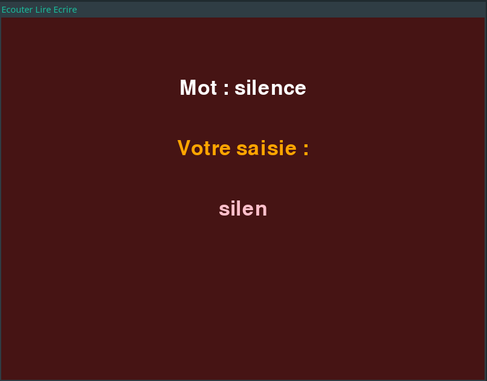

Voici un modèle de fichier **`README.md`** pour ton projet, en anglais, avec les différentes sections demandées :

---

# Learning Game for Kids - Reading and Writing Practice

This Python project is a simple game designed for children who are learning to read and write. The game displays a random word on the screen, reads it aloud using text-to-speech (TTS), and the child types the word. If the child types the word correctly, they are congratulated with a sound and a fun image. The game is designed to be forgiving of typing mistakes, allowing children to correct themselves as they play.



## Features

- Random word selection from a predefined list.
- Text-to-speech feature (TTS) to read words aloud using the **gTTS** library.
- Child-friendly interface that ignores typing mistakes.
- A congratulatory sound and image appear upon correct typing.

## Installation

To run the game, you need Python 3 installed on your machine. You also need the following libraries:

- **gTTS** for text-to-speech conversion
- **Pygame Zero (pgzero)** for the game engine and display

You can install the required libraries by running:

```bash
pip install gtts pgzero
```

## Usage

To start the game, run the following command:

```bash
python main.py
```

Make sure you have your list of words and images prepared and correctly referenced in the code.

## ChatGPT

Made with the help of chatGPT since it's very basic.
